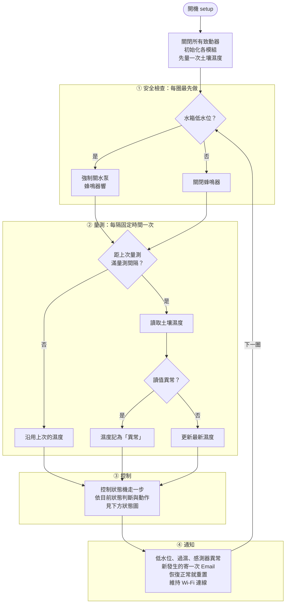
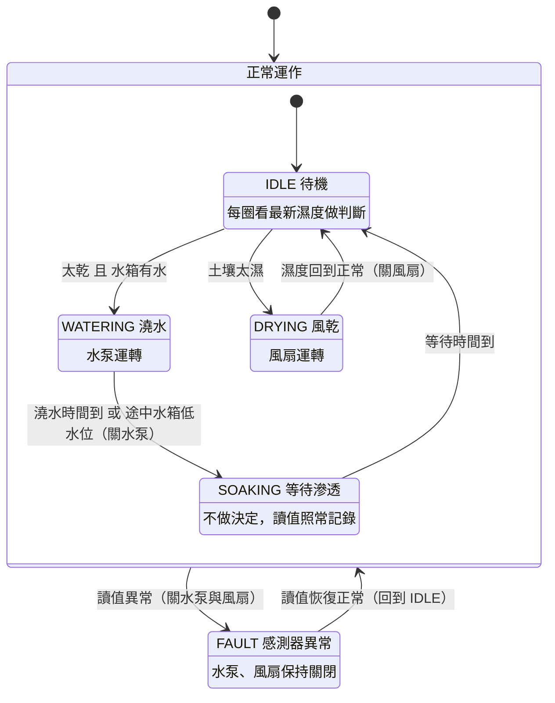

# 主程式流程

## 主迴圈

loop() 一秒會跑上萬圈。每一圈依序做四件事，每件事都只做一小段就往下走，不會用 `delay()` 停下來等，所以安全檢查每一圈都會執行。

- **安全檢查**放在最前面：低水位時直接關水泵，不管控制狀態機現在在哪個狀態。
- **量測**每隔固定時間（`SAMPLE_INTERVAL_MS`）才讀一次感測器，其他圈沿用上次的值。讀感測器需要一點時間，而且土壤濕度變化很慢，沒必要每圈都讀；如果感測器採用只在量測時通電，也能減少腐蝕。
- **控制**每一圈都要執行，即使這圈沒有新讀值，因為澆水時間要準時結束。
- **通知**集中在最後處理，同一種異常在恢復正常前只寄一次。

## 控制狀態機

控制狀態機負責所有致動決策。澆水不是「低於門檻就一直開水泵」，而是補一段時間後等待滲透，再用新的讀值重新判斷，用來處理土壤濕度的延遲：水澆下去後，要一段時間才會被感測器讀到。土壤太濕時進入風乾，濕度回到正常範圍才關風扇。

- 狀態機同一時間只會在一個狀態，所以澆水和吹風不會同時發生。
- 澆到一半水箱低水位時，也進入 SOAKING：已經澆進去的水還沒滲到感測器，先等滲透再判斷，避免補完水箱後馬上又多澆一次。
- 讀值異常時（例如感測器的線鬆脫，讀到不合理的數值），不論目前在哪個狀態都進入 FAULT，水泵和風扇全部關閉；讀值恢復正常後回到 IDLE 重新判斷。「正常運作」大框把四個狀態包在一起，所以只畫一條線，就代表四個狀態都這樣處理。框內的黑點表示每次進入「正常運作」都從 IDLE 開始。
- 「讀值異常」的判斷標準由土壤感測模組定義，`readSoilMoisture()` 回傳 -1 代表異常。

## 模組與負責人

| 模組 | 檔案 | 負責人 | 主要函式 |
|---|---|---|---|
| 主程式 | `SmartPlanter.ino` | 建瑄 | `setup()`、`loop()` |
| 土壤感測 | `soil_sensor.cpp` | 淯瑋 | `readSoilMoisture()` |
| 控制邏輯 | `control.cpp` | 明杰 | `controlUpdate()` |
| 致動器 | `actuators.cpp` | 玟君 | `pumpOn()`、`fanOn()`、`buzzerOn()` |
| 水位與安全 | `safety.cpp` | 娟華 | `checkWaterSafety()`、`isLowWater()` |
| 通知 | `notify.cpp` | 承儒 | `sendAlert()`、`notifyUpdate()` |
